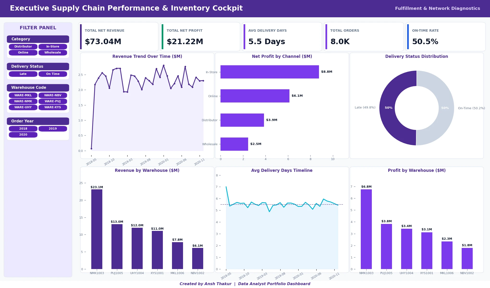
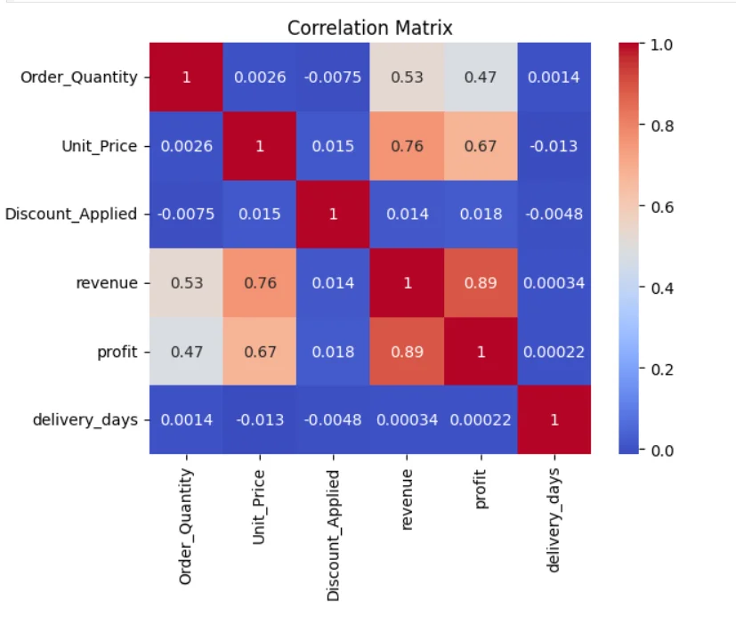
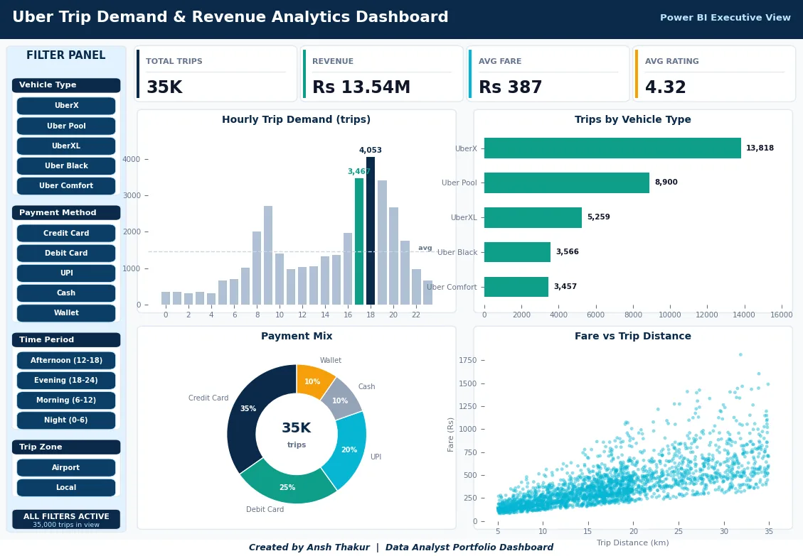
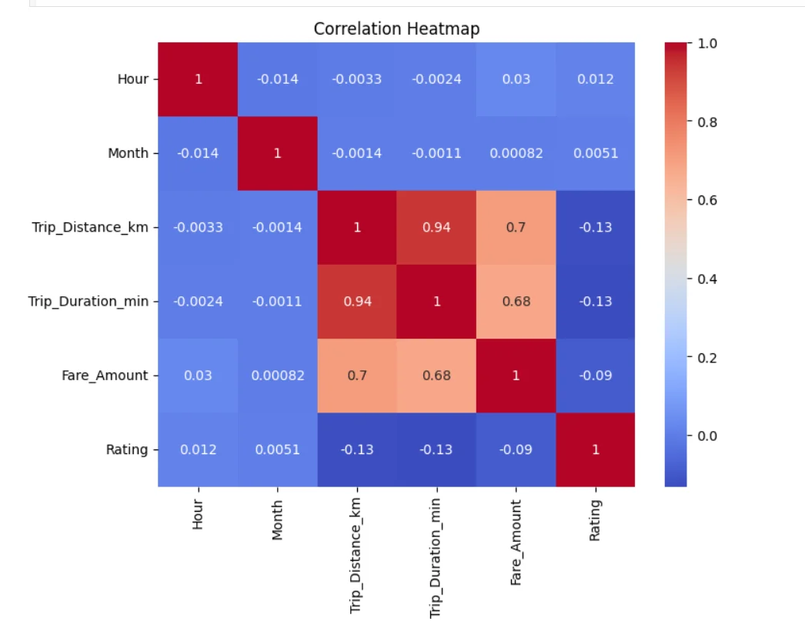

<div align="center">

# 👨‍💻 Ansh Thakur — Data Analyst Portfolio

### Data Analyst | Python, SQL, Power BI & Excel | Data Analytics & Business Intelligence


---

[](https://ansh-thakur.netlify.app/)
[](https://gitlab.com/ansht_121/data-analytics)
[](https://www.linkedin.com/in/ansh-thakur-5407192b4/)
[](mailto:ansht1194@gmail.com)

</div>

---

**I answer business questions with data — including the ones where the answer is "don't do it."**

Two end-to-end analytics projects covering **42,991 records**: a supply-chain P&L and fulfilment audit, and a ride-demand and pricing analysis. Every figure below is reproducible from the committed SQL and Python in my [Data Analytics repository](https://gitlab.com/ansht_121/data-analytics).

As an **entry-level Data Analyst**, I specialize in translating complex datasets into clean, reliable, and actionable business insights.

---

## 📈 Portfolio at a Glance

| Project | Scale | Stack | Headline Result |
|---------|-------|-------|-----------------|
| **Supply Chain Performance** | 7,991 orders · 47 SKUs | Python · SQL · Excel VBA | $82.7M revenue / $30.9M profit analysed; late delivery proven systemic, not warehouse-specific |
| **Uber Trip Demand** | 35,000 trips | MySQL · Python · Power BI | 5–7 PM carries 31.2% of demand; airport trips are 39.6% of volume but 54.8% of revenue |

---

## 🛠️ Core Analytical Skills & Tools

| Category | Technologies & Libraries | Key Methodologies |
| :--- | :--- | :--- |
| **Languages** | Python, SQL, HTML/CSS | Exploratory Data Analysis (EDA), Statistical Analysis |
| **Data Libraries** | Pandas, NumPy, Scikit-Learn, Matplotlib, Seaborn, Plotly | Data Cleaning, Data Validation, Data Preprocessing |
| **BI & Visualization** | Power BI, Advanced Microsoft Excel | Interactive Dashboard Design, Executive KPI Reporting |
| **Development Workflow** | Google Colab, Jupyter Notebook, VS Code, Git & GitLab | Reproducible Analysis, Automation Scripting |
| **SQL Techniques** | CTEs, `LAG()`, `RANK()`, `ROW_NUMBER()`, running `SUM() OVER`, `STDDEV_SAMP` | Variance Decomposition, Pareto Analysis, Trend Detection |

---

## 🎯 Business Questions I Answered

If an interviewer asks one of these, the query and the number are already in my [repository](https://gitlab.com/ansht_121/data-analytics).

| Business Question | Finding | Decision It Drives |
|:--|:--|:--|
| Half our orders are late — which warehouse is at fault? | **None.** Only **0.08%** of delivery-time variance is between warehouses; all six have 2.82–2.88 day spread. | Fix upstream scheduling, not a facility — a per-site project would fix nothing |
| Isn't our biggest warehouse the worst offender? | **No — a volume illusion.** It causes 31.9% of late orders but handles 31.4% of all orders. | Always normalise counts by volume before ranking anything |
| Are discounts eating our margin? Should we cap them? | **No.** Orders at 20%+ discount return **38.28%** margin — *higher* than the 5–10% band. | Don't cap discounts; you'd lose revenue protecting nothing |
| When should a ride-hailing firm surge-price? | **5–7 PM carries 31.2% of demand** in 3 of 24 hours — and the surge *starts* at 5 PM, not 6 PM when volume peaks. | Launch driver incentives by 4:30 PM, an hour ahead of peak |
| Do higher-rated drivers earn more per trip? | **No, and the obvious read is backwards.** Low-rated drivers show higher fares — but only because they drive longer trips. Fare-per-km is flat at ₹22.06–22.41. | Investigate long-trip rider experience; don't penalise drivers |
| Can we focus on just our top revenue zones? | **No.** It takes **4 of 5 zones** to reach 80% of revenue. | Keep coverage city-wide — the 80/20 assumption fails here |

**Six of these; four say "don't act."** Knowing where *not* to spend is the part that saves budget.

---

## 📊 Featured Analytical Projects

### 1. 📦 [Supply Chain Performance Analysis](https://gitlab.com/ansht_121/data-analytics/-/tree/main/supply-chain-performance-analysis)





*An end-to-end operational analytics project featuring a Python data cleaning pipeline, custom SQL metrics, and an automated, fully interactive 10-chart Excel dashboard.*

* **Business Challenge:** Half of all orders miss the 5-day delivery target, with $41.0M of revenue exposed — and leadership needs to know whether to invest in a specific warehouse or the network.
* **Tech Stack:** Python (Pandas, openpyxl), SQL (MySQL — CTEs, `STDDEV`, `LAG`, window functions), Microsoft Excel (VBA, Macros, Pivot Tables).
* **Key Achievements:**
  * **Disproved the obvious answer.** Ranking warehouses by late-order count blames the largest site; variance decomposition shows only **0.08%** of delivery-time variance is between warehouses. Prevented a misdirected improvement programme.
  * Cleaned and processed raw transactional data, generating dynamic metrics like **Delivery Days**, **Order-to-Ship Days**, and **Profit Margins** ($82.7M gross revenue / $30.9M profit across 7,991 orders).
  * Implemented an automated Excel workbook generator using `openpyxl` with dynamic dropdown selectors, date-range inputs, and custom formula-driven pivot tables.
  * Used **ABC Classification** to segment the 47-SKU catalogue by revenue contribution (A-items = 78.7% of revenue) — with an honest read that this catalogue shows only moderate, not textbook 80/20, concentration.
  * Shipped a reproducible Python pipeline so every quoted figure regenerates from the raw data.

### 2. 🚖 [Uber Trip Demand Analysis](https://gitlab.com/ansht_121/data-analytics/-/tree/main/uber-trip-demand-analysis)





*A comprehensive revenue and behavioral analysis of ride-sharing transactions using SQL data warehousing, Python visualization, and Excel dashboarding.*

* **Business Challenge:** Identifying when to surge-price, where to position premium vehicles, and which fleet tier to grow across 35,000 trips.
* **Tech Stack:** MySQL (window functions, CTEs, `LAG`, running totals), Python (Seaborn, Matplotlib), Advanced Excel, Power BI.
* **Key Achievements:**
  * Used `LAG()` to separate peak *volume* from peak *growth* — demand accelerates at **5 PM (+138%)**, an hour before the 6 PM volume peak, moving the incentive trigger an hour earlier.
  * Caught a confounded metric: lower-rated drivers appear to earn more, but the effect vanishes once trip distance is controlled for (**fare-per-km flat at ₹22.06–22.41**).
  * Quantified that **airport trips are 39.6% of volume but 54.8% of revenue** (₹535.77 vs ₹289.40 avg fare).
  * Built a MySQL schema over 35,000 records with `ROW_NUMBER()` deduplication and null validation.
  * Conducted vehicle-category analysis measuring revenue per ride and revenue-to-distance efficiency (Uber Black ₹40.06/km vs Uber Pool ₹14.08/km).
  * Reported three **negative findings** (no weekend fare effect, no seasonality, no zone concentration) that removed unjustified recommendations.

---

## 💼 Experience

**Data Analytics Intern** — *Unified Mentor Pvt. Ltd.* (Sep 2025 – Dec 2025)

- Performed data cleaning, transformation, and validation on large datasets using Python (Pandas) and Excel
- Built automated reporting workflows and KPI dashboards for business stakeholders
- Applied SQL for data extraction, joins, subqueries, and window functions
- Developed Power BI dashboards with DAX measures for executive reporting
- Collaborated with cross-functional teams to gather requirements and document analytical processes

---

## 🎓 Education

**Bachelor of Science in Information Technology (B.Sc. IT)**
*Sardar Patel Mahavidyalaya, Chandrapur — Gondwana University, Maharashtra*
**CGPA: 7.26/10** · 2022 – 2025

---

## 🧾 Certifications

- **Deloitte Data Analytics Job Simulation** — Forage ([Verify](https://www.theforage.com/completion-certificates/9PBTqmSxAf6zZTseP/io9DzWKe3PTsiS6GG_9PBTqmSxAf6zZTseP_Pn2fgx9uC9r33pJRp_1750857267981_completion_certificate.pdf))
- **Tata GenAI Powered Data Analytics Job Simulation** — Forage ([Verify](https://www.theforage.com/completion-certificates/ifobHAoMjQs9s6bKS/gMTdCXwDdLYoXZ3wG_ifobHAoMjQs9s6bKS_Pn2fgx9uC9r33pJRp_1752581188250_completion_certificate.pdf))
- **British Airways Data Science Job Simulation** — Forage ([Verify](https://forage-uploads-prod.s3.amazonaws.com/completion-certificates/tMjbs76F526fF5v3G/NjynCWzGSaWXQCxSX_tMjbs76F526fF5v3G_Pn2fgx9uC9r33pJRp_1754161186122_completion_certificate.pdf))

---

## 📄 Resume

[Download Resume (PDF)](Ansh_Thakur_Data_Analyst_Resume.pdf)

---

## 📂 Repository Structure

```bash
ansh-thakur-portfolio/
│
├── images/                     # Dashboard & heatmap screenshots
├── Ansh_Thakur_Data_Analyst_Resume.pdf
└── README.md                   # This portfolio
```

---

## 📬 Contact & Collaboration

I am actively seeking entry-level **Data Analyst**, **Business Intelligence Analyst**, or **Data Engineer** roles where I can help teams turn complex data into clean, business-boosting decisions.

<div align="center">

[](https://ansh-thakur.netlify.app/)
[](https://gitlab.com/ansht_121/data-analytics)
[](https://www.linkedin.com/in/ansh-thakur-5407192b4/)
[](mailto:ansht1194@gmail.com)

</div>

Feel free to browse my code, download the interactive Excel dashboards to explore their dynamic filters, or connect with me on LinkedIn!
